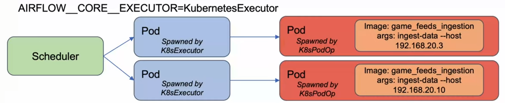
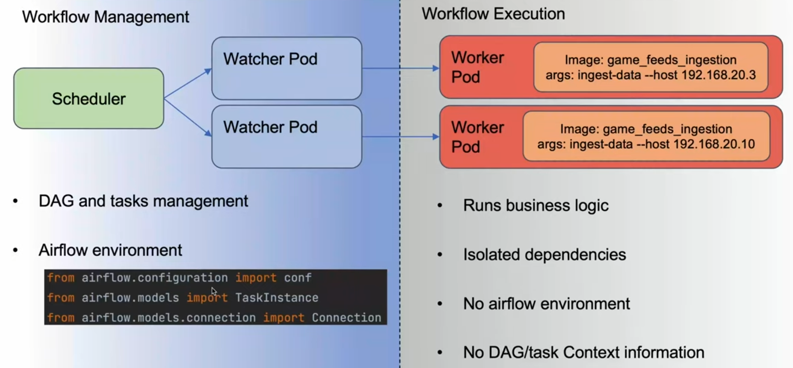

# rpi-k3s-cluster

This is a tutorial for setting up a Kubernetes master node on Raspberry Pi using k3s. It is mainly following the guide from [this page](https://maxdon.tech/posts/k3s-raspberry-pi/), with some clarifications.
Worker nodes can be added afterwards as more compute servers are available.

## Setup

Assuming a completely fresh RPi setup using Raspbian 64bit OS:

Update the packages:

    sudo apt-get update -y
    sudo apt-get upgrade -y
    sudo apt-get dist-upgrade -y
    sudo apt --fix-broken install -y
    sudo apt autoremove -y
    sudo apt autoclean

Log in to router home page and add raspberrypi device to the reserved DHCP list:

    Device: raspberrypi
    IP: 192.169.10.83
    MAC: DC:A6:32:73:E2:9D

Allow control group function:

    nano /boot/firmware/cmdline.txt

Then append this line to the end of the start options:

    cgroup_enable=cpuset cgroup_enable=memory cgroup_memory=1

Restart the pi

    sudo reboot

Prepare the SSH keys in default `id_rsa` files

    ssh-keygen

Prepare kubelet config file

    kubeconfig=/etc/rancher/k3s/kubelet.config
    sudo mkdir -p $(dirname $kubeconfig)
    sudo tee $kubeconfig >/dev/null <<EOF
    apiVersion: kubelet.config.k8s.io/v1beta1
    kind: KubeletConfiguration
    shutdownGracePeriod: 30s
    shutdownGracePeriodCriticalPods: 10s
    EOF

Install k3s

    curl -sfL https://get.k3s.io | K3S_TOKEN=$K3S_TOKEN sh -s - server \
        --write-kubeconfig-mode '0644' --node-taint 'node-role.kubernetes.io/control-plane:NoSchedule' \
        --disable 'servicelb' --disable 'traefik' \
        --kube-controller-manager-arg 'bind-address=0.0.0.0' --kube-proxy-arg 'metrics-bind-address=0.0.0.0' \
        --kube-scheduler-arg 'bind-address=0.0.0.0' --kubelet-arg 'config=/etc/rancher/k3s/kubelet.config' \
        --kube-controller-manager-arg 'terminated-pod-gc-threshold=10'

In this case we want to run workloads on the master loads too, so we will run the above but remove `--node-taint` portion

Some info on the params specified:

- `-s server` Used to tell K3s to run in server mode (for master node) as opposed to agent mode (for worker nodes)
- `--write-kubeconfig-mode '0644'` Writes the kubeconfig file with the specified mode
- `--node-taint 'node-role.kubernetes.io/control-plane:NoSchedule'` Tells K3s to not schedule any user pods on the master node, K3s common services: core-dns and metric-service will still run on the master node
- `--disable 'servicelb'` Do not install the built-in service load balancer (we will replace it with MetalLb later on)
- `--disable 'traefik'` Do not install Traefik, we will install it manually so we will have access to its configuration
- `--kube-controller-manager-arg 'bind-address=0.0.0.0'` Bind on all addresses to enable metrics scraping from an external node
- `--kube-proxy-arg 'metrics-bind-address=0.0.0.0'` Bind on all addresses to enable metrics scraping from an external node
- `--kube-scheduler-arg 'bind-address=0.0.0.0'` Bind on all addresses to enable metrics scraping from an external node
- `--kubelet-arg 'config=/etc/rancher/k3s/kubelet.config'` Specify the location of the kubelet config file (the one we generated in the previous step)
- `--kube-controller-manager-arg 'terminated-pod-gc-threshold=3'` This setting limits to 3 the number of terminated pods that can exist before the terminated pod garbage collector starts deleting terminated pods.

Setup Rpi's `kubectl`

    mkdir ~/.kube
    cp /etc/rancher/k3s/k3s.yaml ~/.kube/config

Check that master node is running

    kubectl get nodes

## MetalLB Load Balancer

The advantage of MetalLB over the built-it LB is that it allows us assign IP addresses per service, rather than per node.

MetalLB will assign IPs to services from its `AddressPool`. Ideally, these IPs should be reserved by your router so you don't get the case where some other device on your network takes up the IP and the service cannot use it,

Install MetalLB

    kubectl apply -f https://raw.githubusercontent.com/metallb/metallb/v0.14.8/config/manifests/metallb-native.yaml

Inside this repo, there is already a `metallb.yml` with a range of 10 IPs configured: `192.168.10.230-192.168.10.240`. We will apply the pre-configured values by running:

    kubectl apply -f metallb.yml

MetalLB also needs to listen to all ARP packets on the network in order to work, so we need to ensure that our wifi adapter is always on `ifconfig wlan0 promisc`

Run this to configure the Pi to always enable this on startup:
    
    sudo bash -c 'cat > /etc/systemd/system/bridge-promisc.service' <<EOS
    [Unit]
    Description=Makes interfaces run in promiscuous mode at boot
    After=network-online.target

    [Service]
    Type=oneshot
    ExecStart=/usr/sbin/ifconfig wlan0 promisc
    TimeoutStartSec=0
    RemainAfterExit=yes

    [Install]
    WantedBy=default.target
    EOS

    sudo systemctl enable bridge-promisc

Check that MetalLB is correctly installed by running an nginx server behind the LB:

    kubectl create namespace test-metallb
    kubectl create deployment nginx --image=nginx -n test-metallb
    kubectl expose deployment nginx --type=LoadBalancer --name=nginx --port=80 --protocol=TCP -n test-metallb

Then check the `EXTERNAL-IP` is assigned to one of your `192.168.10.XX` addresses:

    kubectl get service -n test-metallb

Test the connection locally using

    curl <EXTERNAL_IP>

Next, we need to ensure that devices on the same network can also connect, so we will need to check the Pi firewall

    sudo apt install ufw
    sudo ufw allow ssh
    sudo ufw allow 80/tcp
    sudo ufw allow 443/tcp
    sudo ufw allow 6443/tcp
    sudo ufw allow 30381/tcp
    sudo ufw enable

This will allow traffic between any device on your network to the Pi. 

Port 6443 is for later on, when you need to connect to the cluster on the Pi, from another device.

Port 30381/tcp is for testing cases where you want to connect directly to a node's IP (NodePort) instead of to the cluster IP.

You should now be able to visit `<EXTERNAL_IP>` on another device's browser and see the nginx welcome message.

## Install Traefik

While MetalLB lets you connect to the cluster and services via IP address, Traefik lets you connect to applications (services) inside the cluster via URL/domain name. Traefik is a reverse proxy that handles the HTTP/HTTPS routing.

MetalLB provides external IP addresses to services of type LoadBalancer (including Traefik itself).

Traefik can be deployed as an Ingress Controller to handle routing for HTTP/HTTPS traffic, while MetalLB manages network-level IP routing for those services.

In our case, MetalLB gives the Traefik service an IP (192.168.10.230-231) which makes it accessible from the network. Traefik then routes any requests made to this IP to services based on the request's domain name.

We disabled the initial installation because we want to grab the latest version available.

First install `helm`

    curl -fsSL -o get_helm.sh https://raw.githubusercontent.com/helm/helm/main/scripts/get-helm-3
    chmod 700 get_helm.sh
    ./get_helm.sh

Then grab the Traefix helm charts

    helm repo add traefik https://traefik.github.io/charts
    helm repo update

This repo already contains a `traefikvalues.yml` so just run:

    helm install --namespace=traefik traefik traefik/traefik --values=traefikvalues.yml --create-namespace

Check that it is installed and has an `EXTERNAL_IP`.

    kubectl get svc -n traefik

## Development Machine Access

Now we need to set up `kubectl` on the machine you will be using to access the cluster remotely.

[Install](https://kubernetes.io/docs/tasks/tools/install-kubectl-linux/) `kubectl` if you haven't already done so.

Then add the Pi's cluster config to your `kube/config` or create a new `kube/config` if it doesn't exist

    mkdir ~/.kube
    nano ~/.kube/config

Looks like this. Change the server host IP to the cluster's IP. This is usually just the Pi's IP address on the network, but you can verify by running `kubectl get nodes -o wide -A` and getting the `INTERNAL_IP`. Change cluster name if you have more than 1 cluster you want to connect to in your dev machine:

    apiVersion: v1
    clusters:
      - cluster:
          certificate-authority-data: ...
          server: https://192.168.10.83:6443
        name: default
    contexts:
      - context:
          cluster: default
          user: default
        name: default
        current-context: default
        kind: Config
        preferences: {}
    users:
      - name: default
        user:
            client-certificate-data: ...
            client-key-data: ...
        
Finally, you should be able to call the cluster from your remote machine with:

    kubectl get nodes 

We can also install Prometheus for monitoring:

    helm repo add prometheus-community https://prometheus-community.github.io/helm-charts
    helm repo update
    helm install prometheus prometheus-community/prometheus --namespace monitoring --create-namespace

If the repo add is timing out, add more nameservers to the Pi:

    sudo nano /etc/resolv.conf

    DNS=1.1.1.1 1.0.0.1 
    FallbackDNS=8.8.8.8 8.8.4.4

# Airflow

A clear explanation of Executor vs Operator:
https://www.youtube.com/watch?v=b1gpbGB058M

# Setup additional worker node 

I am using WSL2 on an old Windows laptop as my worker node. We can follow the same method for Pi, just need to set up SSH forwarding for the Windows > WSL2 section.

https://www.hanselman.com/blog/how-to-ssh-into-wsl2-on-windows-10-from-an-external-machine

**In WSL2**

    sudo apt install openssh-server
    sudo nano /etc/ssh/sshd_config
    > Port 22
    > Listen Address 0.0.0.0
    > PasswordAuthentication yes

**In Admin CMD PROMPT**

Get WSL2 IP

    wsl hostname -I
    > 172.21.63.80

Forward port

    netsh interface portproxy add v4tov4 listenaddress=0.0.0.0 listenport=2222 connectaddress=172.21.63.80 connectport=22
    netsh advfirewall firewall add rule name="Open Port 2222 for WSL2" dir=in action=allow protocol=TCP localport=2222

To remove

    netsh interface portproxy show v4tov4
    netsh int portproxy reset all

Worker is now ssh-able, make sure to specify the windows port 2222

     ssh -p 2222 oliver@192.168.10.204

If getting `ssh_exchange_identification: read: Connection reset by peer` errors, try reinstalling openssh-server

Since k3s worker is running inside WSL2, the INTERNAL IP will be 172.x.x.x, we need to tell k3s worker to advertise their IP as the network IP instead 192.168.10.204:

    curl -sfL https://get.k3s.io | K3S_URL=https://$MASTER_IP:6443 \
    K3S_TOKEN=$MASTER_TOKEN sh -s - --node-label 'node_type=worker' \
    --kubelet-arg 'config=/etc/rancher/k3s/kubelet.config' \
    --kube-proxy-arg 'metrics-bind-address=0.0.0.0' \
    --node-external-ip '192.168.10.204'

Also, restart coreDNS

    kubectl -n kube-system rollout restart deployment coredns

# General learnings

- taint: an attribute applied to a node that 'taints' it from being used for certain purposes. For e.g. a node can be tainted such that pods cannot be scheduled on it - generally used for master nodes where you don't want the control plan to be saddled with workloads
- toleration: a special override given to a pod that allows it be deployed to a node even when it is tainted.
- affinities: pods can 'prefer' or 'only be deployable on' certain nodes, based on the labels referenced.
- local-path-provisioner: a special service for k3s/ rancher that automatically creates PVs when a PVC is referenced. this creates the PV without us having to first define it, it also cleans it up after the PVC is no longer bound.
- PV host path: persistent volumes are partitions carved out from a larger storage class (the disk). we can use the hostPath to specify which direcotry we want th ePV to use.
- storage class reclaim policy: a storage class may reclaim back the space after a PV is deleted. it can do this by 'Delete' the data that was there, or other means
- coreDNS: the nodes are able to talk to each other and to other IPs through the coreDNS
- resource limits and requests. limits are the max a pod can take, requests are the min they are given. requests < limits
- a pod can end up not being schedulable if the PV that is claiming (via PVC) is using storage of a tainted node (when deployments are not properly terminated)
- PVs can be ReadWriteMany or ReadWriteOnce. Many = any pod in a node can mount to it. Once = only a given pod can mount it.